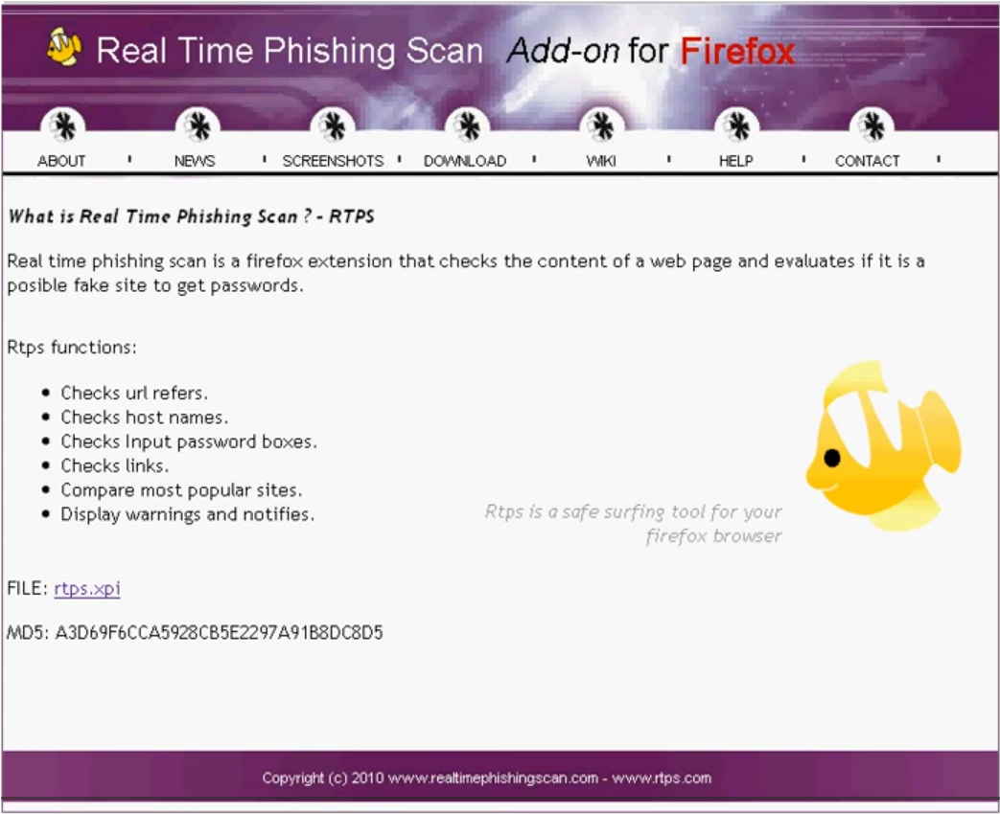
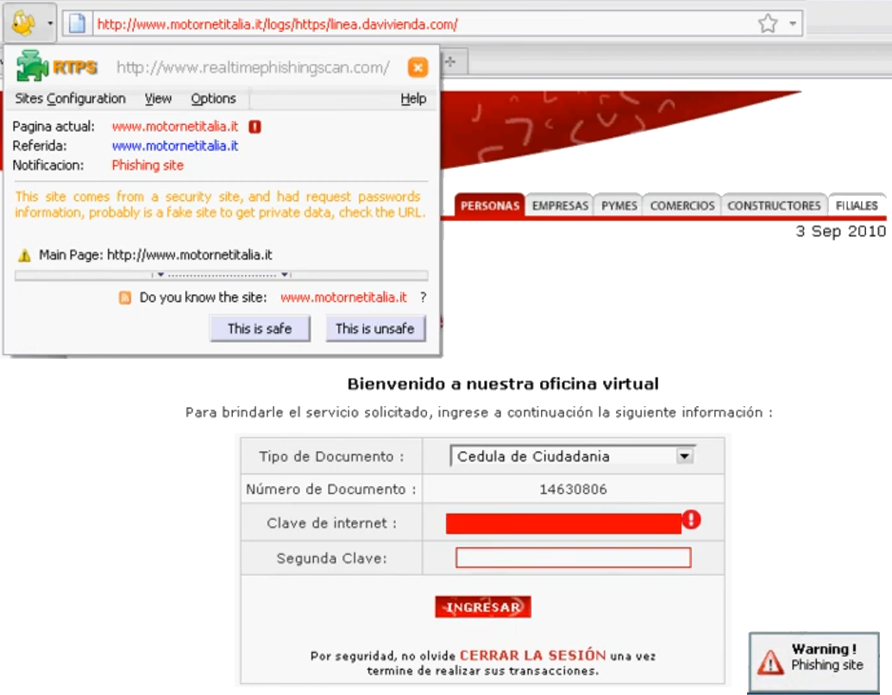
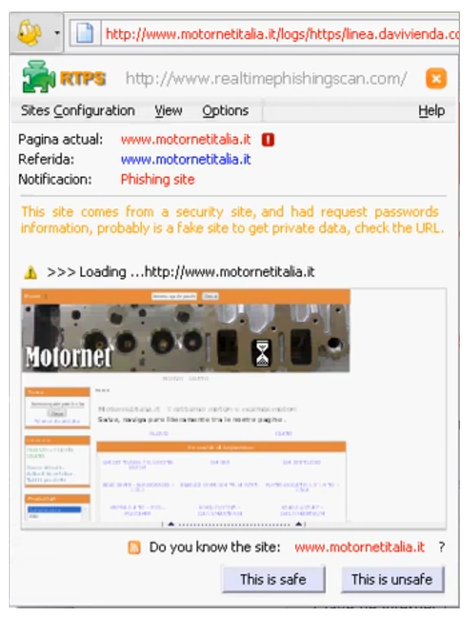
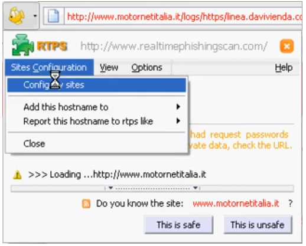
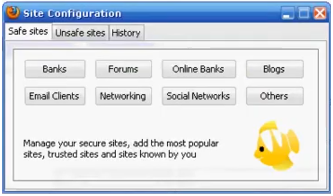

  

## Información (2011)

A continuación se describe la información presente en la imagen about2011.png: resumen del proyecto y objetivos iniciales, enfoque en la detección de intentos de phishing durante la navegación, alertas al usuario y opciones para bloquear o permitir, junto con la gestión de sitios seguros y reporte de incidentes.

## Detecciòn en tiempo real

La extensión muestra un aviso en tiempo real con:
- Dominio analizado y URL sospechosa.
- Nivel de riesgo y tipo de amenaza.
- Enlace para cargar el sitio original y acciones recomendadas (permitir, bloquear, ver detalles).

## Detalles de la extensión

Se puede cargar información del sitio original, mostrando un screen del Home y ofreciendo las opciones de adicionar como seguro o sitio inseguro.

## Opciones de menu

Opciones principales del menú:
- Ver sitio original: abre la página legítima para comparación.
- Ver detalles: muestra el análisis técnico y los indicadores de riesgo.
- Marcar como seguro: añade el dominio a la lista de sitios confiables.
- Marcar como inseguro: etiqueta el sitio y bloquea el acceso futuro.
- Reportar phishing: envía un reporte del incidente.
- Sitios seguros: abre la gestión de la lista blanca.
- Configuración: ajusta preferencias y comportamiento de la extensión.
- Ayuda: acceso a documentación y soporte.

## Configuración de sitios

La imagen muestra la sección “Sitios seguros”: listado de dominios confiables, opciones para agregar/editar/eliminar entradas, controles para guardar cambios y aplicar reglas por dominio o subdominio.

## Información adicional
https://www.youtube.com/@realtimephishingscan

La extensión inició en el año 2010 como un proyecto de seguridad informática y se pueden observar sus primeros lanzamientos en el canal de YouTube.