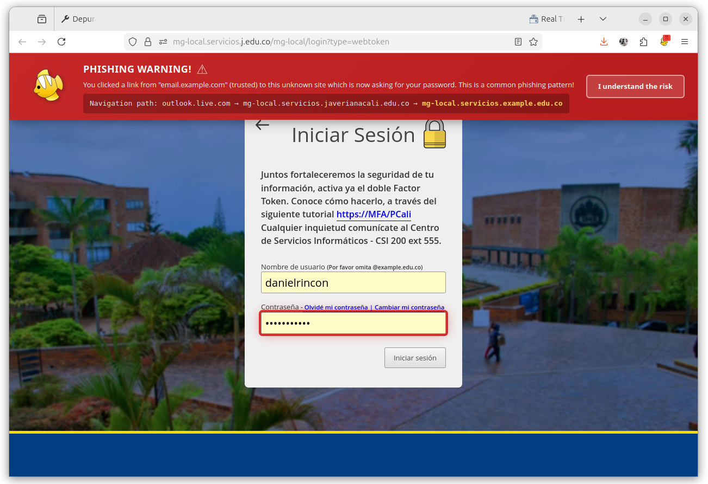
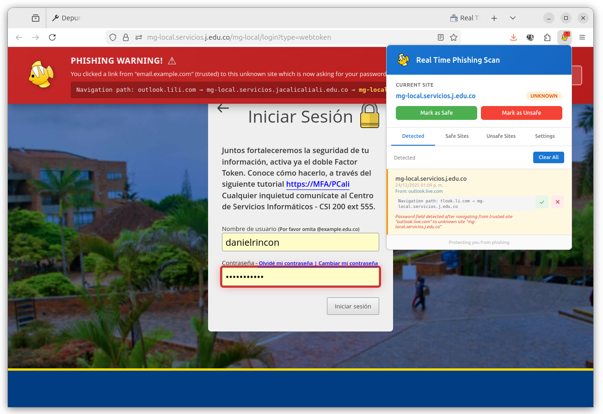
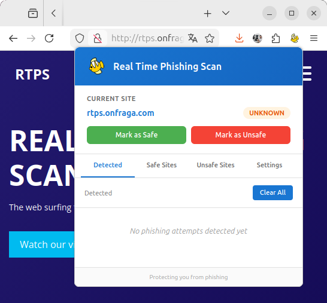
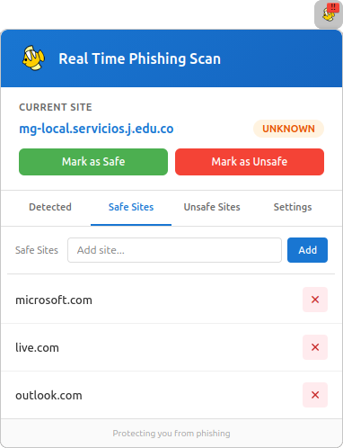
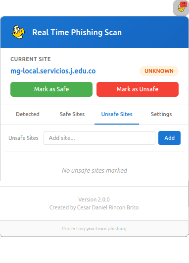
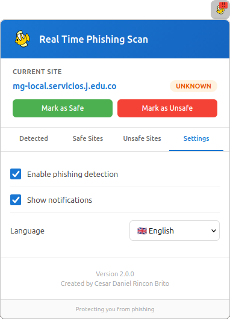
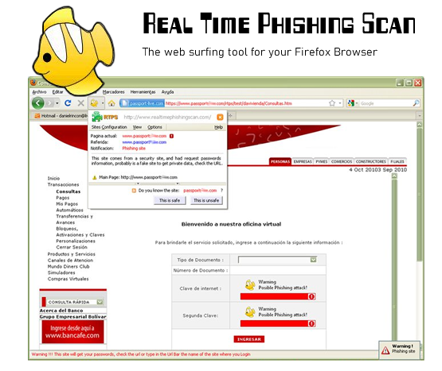

# Real Time Phishing Scan - Add-on for Firefox - V 2.0.0 - 2025

## What is Real Time Phishing Scan? - RTPS

Real Time Phishing Scan es una extensión para Firefox que analiza el contenido de una página web y evalúa si es un posible sitio falso diseñado para robar contraseñas.

### Funciones de RTPS:

- Verifica el URL referer
- Analiza los nombres de host
- Detecta campos de contraseña en formularios
- Examina formularios sospechosos
- Compara con los títulos de sitios más populares

> *"RTPS is a safe surfing tool for your web browser"*

**Archivo:** rtps.xpi
**Versión:** 2.0.0
**Autor:** Cesar Daniel Rincon Brito

---

## Detección en tiempo real - Notificación DOM

  

Cuando RTPS detecta un sitio sospechoso, muestra una **barra de notificación amarilla** en la parte superior del navegador con el mensaje:

- **PHISHING WARNING!** - Alerta visual destacada
- Indica que el sitio está solicitando contraseñas y podría ser un sitio de phishing
- Botón **"I understand the risk"** para continuar si el usuario conoce el sitio

La notificación aparece automáticamente cuando se detecta un formulario de contraseña en un sitio que viene referido desde otro dominio.

---

## Panel de la extensión con notificación activa

  

Al hacer clic en el icono de RTPS mientras hay una detección activa, se muestra el panel lateral **"Real Time Phishing Scan"** junto con la notificación DOM, permitiendo al usuario:

- Ver el estado actual del sitio
- Acceder rápidamente a las opciones de marcado (Safe/Unsafe)
- Gestionar la configuración de la extensión

---

## Interfaz principal del popup

  

El popup principal de RTPS muestra:

- **CURRENT SITE:** El dominio del sitio actual que está visitando
- **Estado:** UNKNOWN (desconocido), SAFE (seguro) o UNSAFE (inseguro)
- **Botones de acción:**
  - **Mark as Safe** (verde) - Marcar el sitio como seguro
  - **Mark as Unsafe** (naranja) - Marcar el sitio como inseguro

**Pestañas de navegación:**
- **Detected:** Historial de sitios detectados como posible phishing
- **Safe Sites:** Lista de sitios marcados como seguros
- **Unsafe Sites:** Lista de sitios marcados como inseguros
- **Settings:** Configuración de la extensión

*"Protecting you from phishing"*

---

## Gestión de sitios seguros (Safe Sites)

  

La pestaña **Safe Sites** permite administrar la lista de sitios de confianza:

- **Campo de texto:** Para agregar nuevos dominios manualmente
- **Botón Add:** Agregar el dominio a la lista
- **Lista de sitios:** Muestra todos los sitios marcados como seguros
- **Botón X:** Eliminar un sitio de la lista

Ejemplos de sitios seguros preconfigurados:
- microsoft.com
- live.com
- outlook.com

---

## Gestión de sitios inseguros (Unsafe Sites)

  

La pestaña **Unsafe Sites** permite administrar la lista de sitios marcados como peligrosos:

- Misma interfaz que Safe Sites
- Los sitios agregados aquí siempre mostrarán alertas de phishing
- Útil para bloquear sitios conocidos como maliciosos

**Información de la extensión:**
- **Version:** 2.0.0
- **Created by:** Cesar Daniel Rincon Brito

---

## Configuración (Settings)

  

La pestaña **Settings** ofrece las siguientes opciones:

- **Enable phishing detection:** Activa o desactiva la detección de phishing
- **Show notifications:** Activa o desactiva las notificaciones DOM
- **Language:** Selector de idioma (English, Español, etc.)

Estas opciones permiten personalizar el comportamiento de la extensión según las preferencias del usuario.

---

## Información de la extensión (About)

  

La página de información de la extensión en Firefox muestra:

- **Nombre:** Real Time Phishing Scan
- **Descripción:** Detector de sitios falsos para robar contraseñas - Te protege de ataques de phishing en tiempo real
- **Autor:** Cesar Daniel Rincon Brito
- **Versión:** 2.0.0
- **Última actualización:** 24 de diciembre de 2025
- **Página de inicio:** https://github.com/cesarincon/Real-Time-Phishing-Scan

**Permisos disponibles:**
- Ejecutar en ventana privada
- Ejecutar en sitios con restricciones

---

## Novedades en la versión 2.0.0

- Nueva interfaz de usuario moderna y limpia
- Notificaciones DOM integradas en la página
- Panel popup rediseñado con pestañas
- Soporte multiidioma (Inglés/Español)
- Gestión mejorada de sitios seguros e inseguros
- Configuración personalizable
- Compatible con las últimas versiones de Firefox

---
---

# Real Time Phishing Scan - Add-on for Firefox - V 1.0.0 - 2011

  

## What is Real Time Phishing Scan? - RTPS (Legacy)

Real Time Phishing Scan es una extensión para Firefox que analiza el contenido de una página web y evalúa si es un posible sitio falso diseñado para robar contraseñas.

### Funciones de RTPS:

- Verifica el URL referer
- Analiza los nombres de host
- Detecta campos de contraseña en formularios
- Examina formularios sospechosos
- Compara con los títulos de sitios más populares

> *"RTPS is a safe surfing tool for your web browser"*

**Archivo:** rtps.xpi
**MD5:** A2b4f96CA953D838E22190A91BB0D8D5

---

## Detección en tiempo real

  

La extensión muestra una barra de notificación en la parte superior del navegador que indica:

- **Página actual:** La URL del sitio que está visitando
- **Referida:** El sitio de origen que lo redirigió
- **Notificación:** Estado del sitio (Phishing site)

Cuando se detecta un sitio sospechoso, RTPS muestra una advertencia: *"This site comes from a security site, and had request passwords information, probably is a fake site to get private data, check the URL."*

En la esquina inferior derecha aparece una alerta visual de **"Warning! Phishing site"** para alertar al usuario del peligro potencial.

---

## Detalles de la extensión

  

La extensión permite cargar información del sitio original, mostrando una vista previa (screenshot) del Home del sitio legítimo. Esto ayuda al usuario a comparar visualmente si el sitio que está visitando corresponde realmente al sitio oficial.

Además, ofrece las siguientes opciones de acción:
- **This is safe:** Marcar el sitio como seguro si el usuario lo conoce y confía en él
- **This is unsafe:** Confirmar que el sitio es inseguro y potencialmente peligroso

---

## Opciones de menú

  

El menú **Sites Configuration** ofrece las siguientes opciones:

- **Config sites:** Abre la ventana de configuración de sitios donde puede administrar sus listas de sitios seguros e inseguros
- **Add this hostname to:** Permite agregar el hostname actual a una categoría específica (sitios seguros o inseguros)
- **Report this hostname to RTPS like:** Reportar el sitio actual al sistema RTPS para ayudar a mejorar la base de datos de sitios maliciosos
- **Close:** Cerrar el menú de opciones

---

## Configuración de sitios

  

La ventana de **Site Configuration** permite administrar los sitios en tres pestañas:

- **Safe sites:** Sitios marcados como seguros
- **Unsafe sites:** Sitios marcados como inseguros
- **History:** Historial de sitios visitados

Los sitios seguros se pueden organizar por categorías:
- **Banks** - Bancos
- **Forums** - Foros
- **Online Banks** - Banca en línea
- **Blogs** - Blogs
- **Email Clients** - Clientes de correo
- **Networking** - Redes
- **Social Networks** - Redes sociales
- **Others** - Otros

> *"Manage your secure sites, add the most popular sites, trusted sites and sites known by you"*

---

## Información adicional

La extensión Real Time Phishing Scan inició en el año **2010** como un proyecto de seguridad informática enfocado en proteger a los usuarios de sitios de phishing mientras navegan por internet.

Puedes observar los primeros lanzamientos y demostraciones de la extensión en el canal oficial de YouTube:

**YouTube:** [https://www.youtube.com/@realtimephishingscan](https://www.youtube.com/@realtimephishingscan)

---

*Copyright 2010-2025 - rtps.onfraga.com*
